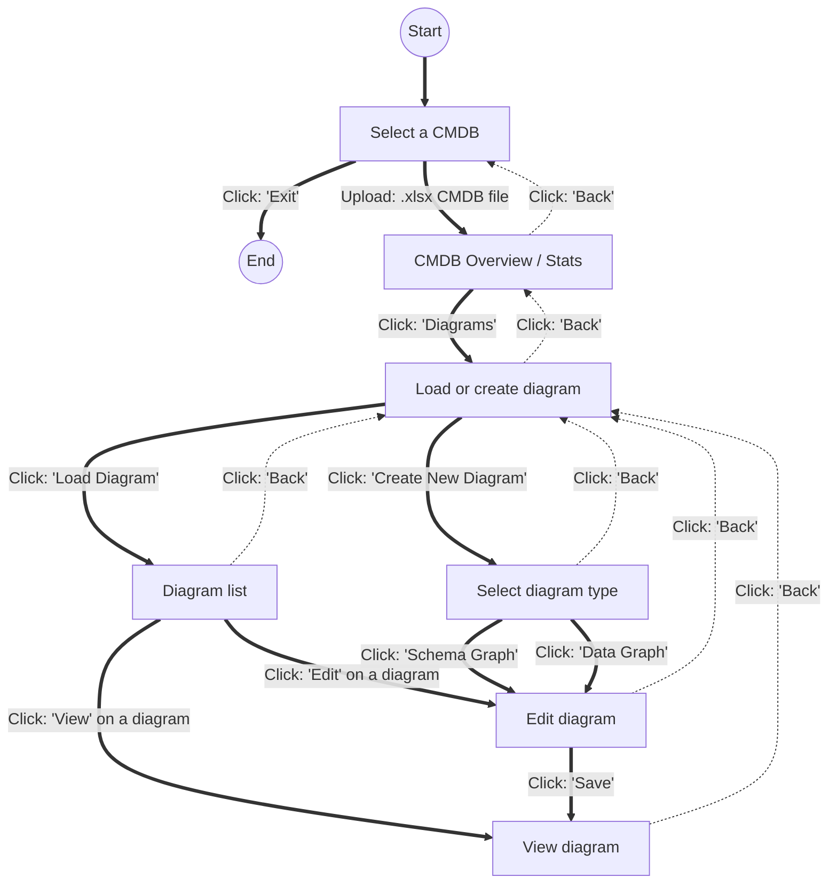
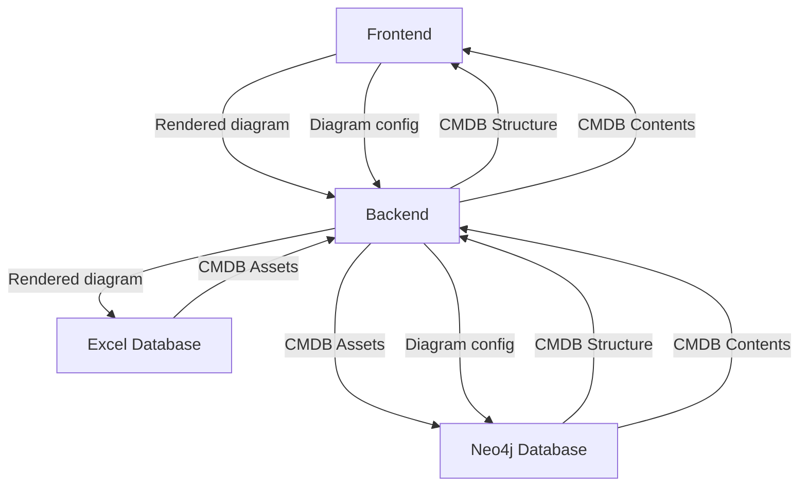

# SE 4485 Project: Disaster Recovery Mapping App

## [Demo](https://drive.google.com/file/d/1741aa_tguOSqy1Pvi7uL9-o0IflHapt-/view?usp=drive_link)

## [Slides](https://docs.google.com/presentation/d/e/2PACX-1vS_aNyQDyKtzwJlb9gqzwD-AqBPWjtSt2gXDVk_rtCTKwmmSi_5vJ4WhjuNEatZUhHmBgoE0t1eDziT/pubembed?start=true&loop=false&delayms=3000)

## Installer

- Download the MSI installer from [the latest release](https://github.com/pmaxhogan/4485-project/releases/latest)

## Local Setup

1. Clone the repository
2. Install Node.js (>= 23.10.0 validated)
3. Install packages: `npm install`
4. Run locally `npm run dev`
   - This may take a while the first time. Later runs should be faster

## Scripts

### Dev

- `npm run dev`: starts the app in development mode (w/ hot reload)
- `npm run build`: compiles vue & typescript into a build with electron
- `npm run package`: builds the app and creates a MSI installer (done by CI when a commit to main is tagged with a new version)

### Quality

- `npm run format`: runs prettier to format files as needed
- `npm run format:ci`: like `npm run format`, but fails if changes are needed instead of writing them (used in CI)
- `npm run lint`: runs eslint to find code problems (fixing them if possible)
- `npm run lint:ci`: like `npm run lint`, but will not fix fixable problems

### Unit tests

- `npm run test:unit`: runs unit tests
- `npm run coverage`: runs unit tests with coverage
- `npm run coverage:ui`: runs unit tests with coverage & opens the coverage UI tool

### e2e/integration tests

- `npm run test:package`: builds the app binaries required for testing. **do this before running e2e tests!**
- `npm run test:e2e:driver`: runs the chromedriver server needed for e2e tests. **must be running to run e2e tests!**
- `npm run test:e2e`: runs e2e / requirements tests
- `npm run test:e2e:bench`: runs benchmark / NFR tests

## Activity Diagram

# Architectural Model

---

# Vue 3 + TypeScript + Vite

This template should help get you started developing with Vue 3 and TypeScript in Vite. The template uses Vue 3 `<script setup>` SFCs, check out the [script setup docs](https://v3.vuejs.org/api/sfc-script-setup.html#sfc-script-setup) to learn more.

## Recommended IDE Setup

- [VS Code](https://code.visualstudio.com/) + [Volar](https://marketplace.visualstudio.com/items?itemName=Vue.volar) (and disable Vetur) + [TypeScript Vue Plugin (Volar)](https://marketplace.visualstudio.com/items?itemName=Vue.vscode-typescript-vue-plugin).

## Type Support For `.vue` Imports in TS

TypeScript cannot handle type information for `.vue` imports by default, so we replace the `tsc` CLI with `vue-tsc` for type checking. In editors, we need [TypeScript Vue Plugin (Volar)](https://marketplace.visualstudio.com/items?itemName=Vue.vscode-typescript-vue-plugin) to make the TypeScript language service aware of `.vue` types.

If the standalone TypeScript plugin doesn't feel fast enough to you, Volar has also implemented a [Take Over Mode](https://github.com/johnsoncodehk/volar/discussions/471#discussioncomment-1361669) that is more performant. You can enable it by the following steps:

1. Disable the built-in TypeScript Extension
   1. Run `Extensions: Show Built-in Extensions` from VSCode's command palette
   2. Find `TypeScript and JavaScript Language Features`, right click and select `Disable (Workspace)`
2. Reload the VSCode window by running `Developer: Reload Window` from the command palette.
